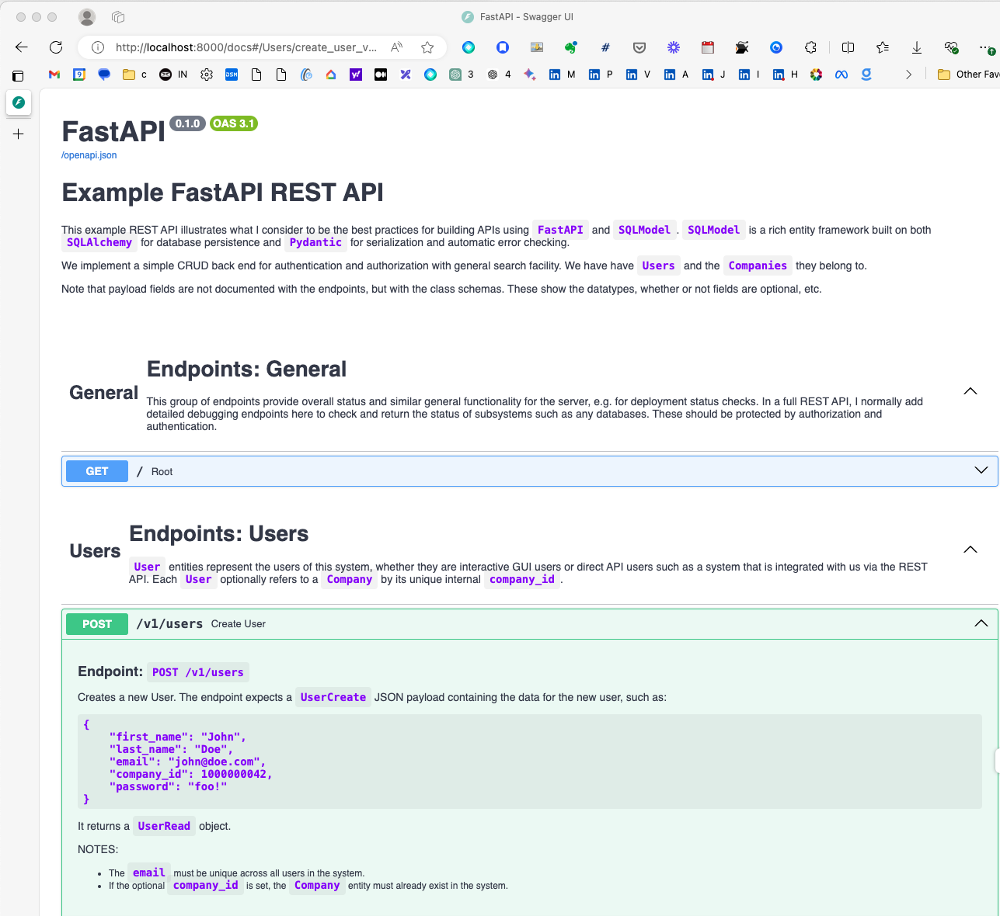
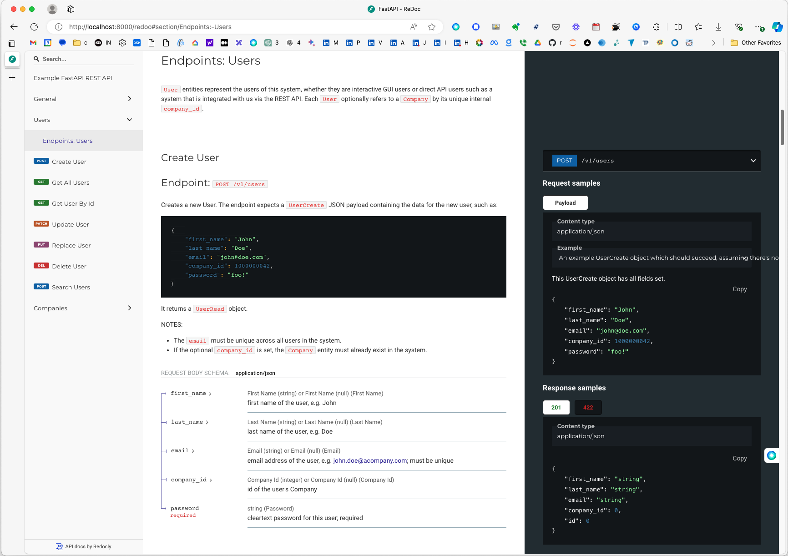
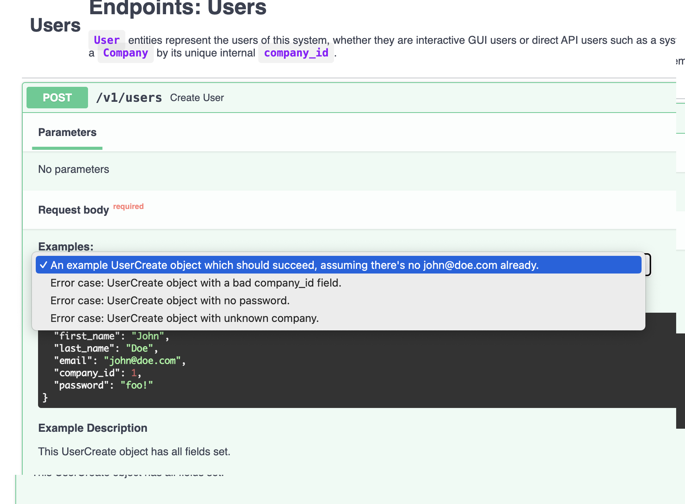
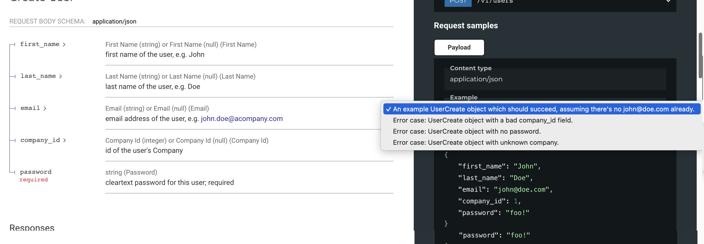

# Best Practices for Modern REST APIs in Python

Over the last few months, I built a REST API in modern Python for my latest startup. This isn't my first time developing REST APIs – I've built them for two previous startups, one in Java (heavy on reflection, where I had to built a lot of the framework features you'll see below myself) and one in Python 2, before the frameworks I'll cover here were available. That experience definitely informs my approach this time around!

The Python language and the libraries we use here have undergone some fairly radical changes in recent years. As a result, a lot of existing documentation and examples are outdated or sketchy. I had to dig deep into forums, read the source code of the libraries, and do quite a bit of experimentation to figure out the best way to use them to create clear API code with maintainable client documentation. *tl;dr:* The guidance you'll find here is not well-covered elsewhere, if at all.

Recently I parted ways with the company, so I started writing this code for myself so that I could document what I found while it was still fresh in my mind. I decided to share it with the community, and hope it will be useful. I'm releasing the associated code under the Apache V2 license, to allow folks to use it as the basis for their own projects.

Of course, this meant writing a new API from scratch, without referring to the code I had just written. A big shout-out to [Workona](https://workona.com/), the best bookmarking plugin in the known Universe. The first time around, I used Workona to carefully organize all the web pages I referred to. That's been part of my workflow the last few years: I create a Workona Workspace for every subproject, and I bookmark the reference material in the workspace, organized by subtopic. I honestly don't know how I worked without it! This reference material made it so much easier to go through this process a second time.

Note that I focus on **CRUD** database endpoints (**C**reate, **R**ead, **U**pdate, **D**elete), since they can be the most tricky: you need to think about both persistence and serialization, and probably want flexible search.

In this document I'll cover:

* **FastAPI**: We're using `FastAPI`, a feature-rich framework for building APIs. It's built on top of `Starlette` (a fast, lower-level asynchronous REST API framework) and `SQLModel`. FastAPI is the creation of Sebastián Ramírez (aka Tiangolo).
* **SQLModel**: Another Tiangolo project, `SQLModel` is an entity-class framework that combines `Pydantic` and `SQLAlchemy`. It lets us create classes with robust JSON serialization and automatic error checking (thanks to Pydantic), plus persistence capabilities (courtesy of SQLAlchemy).
* **Documentation**: We'll document our API using `Swagger` and `ReDoc`. Both tools leverage the `OpenAPI` JSON schema, and are integrated into FastAPI. I'll share some best practices I created to keep your docs maintainable and clutter-free.
* **Flexible Search Functionality**: We'll implement a secure, flexible search feature in the REST API, similar to Notion's flexible, expression-tree-based search.
* **Testing**: Proper testing practices are essential. I'll cover how to ensure your API is robust and reliable, with some neat tricks for database management and sharing endpoint payload examples.

We'll use Python 3.11.5 for all of this, since it's the most up-to-date stable version as of 2024.06.

You can find all the code in [https://github.com/rpeck/medium](https://github.com/rpeck/medium) in the `rest-api` directory.

## Contents

* [SQLModel Entity Classes](#sqlmodel-entity-classes)
  * [CRUD Classes](#crud-classes)
    * [Introspection](#introspection)
    * [Linked Classes](#linked-classes)
    * [An Important Quirk about Imports](#an-important-quirk-about-imports)
* [Documentation](#documentation)
  * [Documenting Entity Fields](#documenting-entity-fields)
  * [Documenting Endpoints](#documenting-endpoints)
  * [Markdown Slicer](#markdown-slicer)
* [FastAPI](#fastapi)
  * [Defining Our Endpoints](#defining-our-endpoints)
    * [What is `async`?](#what-is-async)
      * [Just Remember This:](#just-remember-this)
    * [Database Sessions](#database-sessions)
    * [A More Complex Endpoint](#a-more-complex-endpoint)
      * [SQLAlchemy Magic](#sqlalchemy-magic)
      * [SQLModel / Pydantic Magic](#sqlmodel--pydantic-magic)
* [Flexible Search](#flexible-search)
  * [Search Classes](#search-classes)
  * [Abstract Syntax Trees](#abstract-syntax-trees)
  * [Search Entities](#search-entities)
    * [SearchModel Classes](#searchmodel-classes)
    * [Pydantic-related Details](#pydantic-related-details)
    * [SQLModel Searches](#sqlmodel-searches)
    * [Transforming Our AST Into SQLAlchemy's AST](#transforming-our-ast-into-sqlalchemys-ast)
      * [SearchModel AST](#searchmodel-ast)
      * [SQLModel AST](#sqlmodel-ast)
      * [NotSearchModel](#notsearchmodel)
      * [AndSearchModel and OrSearchModel](#andsearchmodel-and-orsearchmodel)
      * [EntitySearchModel](#entitysearchmodel)
* [Managing Payload Examples](#managing-payload-examples)
  * [ExamplePayloads](#examplepayloads)
* [Testing](#testing)
  * [`EndpointTestFixtures`](#endpointtestfixtures)
  * [`tests/entities/test_search_entities.py`](#testsentitiestest_search_entitiespy)
  * [`tests/entities/test_select_generation.py`](#testsentitiestest_select_generationpy)
  * [`tests/helpers/test_api_docs_helpers.py`](#testshelperstest_api_docs_helperspy)
  * [`tests/helpers/entities_helpers.py`](#testshelpersentities_helperspy)
  * [`tests/api/test_api_users.py`](#testsapitest_api_userspy)
    * [`class TestExamples`](#class-testexamples)
  * [Testing Against a Local Server](#testing-against-a-local-server)
* [Wrapping Up!](#wrapping-up)


## SQLModel Entity Classes

`SQLAlchemy` and `Pydantic` are very rich class frameworks for creating entity classes in your code, e.g. as a basis for `User`, `Group`, and `Employer` classes for managing your users. SQLAlchemy is focused on persistence with popular databases, while Pydantic is focused on three important capabilities: JSON serialization, runtime error checking, and exporting an OpenAPI JSON schema which helps power our API documentation.

Until SQLModel came along, there was no popular Python entity framework that covered _both_ serialization and persistence like it does: if you needed both sets of functionality you would have to either build things from scratch, or maintain two sets of entity classes and keep them in sync, which is obviously painful. Fortunately for us, SQLModel brings together both Pydantic and SQLAlchemy. 

[](https://mermaid.live/edit#pako:eNp1kd1OwzAMhV_Fyi3bCwwJaWv3hzYxViEu0l2Y1Gsj2qRKXEFZ9-6khV4gtFxZPl98LJ-LUDYjMRO5w7qA3fE-NRDeXK7Q8_ywPcF0-tAl5DSW-gtZWwN3kKZm6Zx1EBWk3rXJO1jIQ5uhYa1O44z-K3TL0OMWVInek-9gLZPn3T64liO4GDyWn7V1HIBIPtVkgjckqqAKRywasBdPGSzaDmKZfGCek4PYKn8DWskjBfmG-iijUpNh6I8AOZmRWw_cgZzXnskogg42_d7zsl-p_cv9O8WvuhnUyFZVY7RCJg-vmosOtjJGxjf0NA4SE1GRq1BnIYtL30sFBydKxSyUGZ2xKTkVqbkGFBu2SWuUmLFraCKaOgvTY40hxUrMzlj60KVMs3X7n3yHmK_fdSefpw)

Obviously, mixing together two rich class frameworks is very tricky. SQLModel reaches deep into the bowels of these frameworks and wraps parts of the APIs, so it's not always obvious how to do certain things on the edges of the base functionality: e.g., do we use SQLModel functions for a certain task or do we need to drop down directly to either SQLAlchemy's or Pydantic's API? The guidelines and code in this tutorial should help to clear that up for you.

### CRUD Classes

In this tutorial we're going to create two different kinds of classes: those that represent the entities that our API acts on, and ones that are used for the rich search features we're going to build. In this section we cover the entity classes. It is a simplified version of some of the material in [the FastAPI tutorial](https://fastapi.tiangolo.com/tutorial/) with clarifications and (IMO) some improvements.

When we think about the general case of implementing CRUD (**C**reate, **R**ead, **U**pdate, **D**elete) operations in a REST API, we might need to expose different entity fields for different operations. In [the example in the FastAPI tutorial](https://fastapi.tiangolo.com/tutorial/extra-models/) the use case for this is the `password` field for our User. We want to include the `password` field when we create and update a User, but not when we read them. And we want to persist a `hashed_password`, which we can validate against when we authenticate / authorize. To be clearly represent this, we'll create a separate class for each operation. 

Unlike the examples in the FastAPI tutorial, I think it's best to create a base class to hold all the common fields. This is most important when we have many fields in our classes like I did in my last company. Even if you have a modest list of fields, it's best to start out on the right foot by following [the DRY Principle](https://en.wikipedia.org/wiki/Don't_repeat_yourself) as much as possible: Don't Repeat Yourself (also known as Once and Only Once). When we define things in a single place we're less likely to introduce bugs as we modify and maintain the code. Of course, we need to balance this against introducing complexity to our class hierarchy.

There are some important things to note about how these classes connect to the database:

* One of our classes (`User`, in this case) will represent the entity in the database as a table and will let us perform operations on that table. That fact is marked by the parameter `table=True`
* Our fields in that class will automagically be columns in the table.
* Our `id` field in that class has the `primary_key=True` annotation, which makes it the primary key in the database for this table and also gives us an index on that column for fast search.
* We've marked our `email` field with `index=True` so that it is indexed in the database for very fast searching.
* We've set the `__table_args__ = (UniqueConstraint("email_primary"),)` variable in order to create a database constraint. This will help us by catching application errors. If we try to insert Users with duplicate email addresses we will get an `IntegrityException`.

Note that we have defined `id` and `hashed_password` each in two places, in conflict with the DRY principal. We could do some refactoring to create additional parent or mixin classes to eliminate this, but given that these fields are special cases I think this is a cleaner, simpler solution than making the class hierarchy more complex. The main fields are still all collected in `UserBase`.

[](https://mermaid.live/edit#pako:eNq1VLFOwzAQ_ZXII7QVrBETZUVIoE64so742lpynMh2hKrSf-cSp4rbxgEGvNi593y-e37xgRWVRJazQoNzTwq2FkpuMhpdJFs5tI_g8BCC7bh9qb2qDOh35-062yjrvDBQYpJCmX5gYAlKj6HK-HVWVGUNZi-UDJRjmE61ZQ9f83n3NcSH2CuCTPGXFsFjCl3VskMv9Yi1EMLDh8a2OSEy6uUaE2C3jkDf1BqTPZ56GxFnB26HUtR0_mdlYx7Bl9JR7b8Sb2inFShuiXZlSXJQLO2G8yKvtgdJ_7A9TrAMnUzbcdJmIKVF586Ki7KGq-8D02jsnBRncF6KMeawHvp3k10ZRcnuitzI1UUNTTgl-vs4u1ssbjhrT-HsnhZ9irx1M5uxEi35VtLL0yXkzO-QLo7ltJS4gUZ7zrg5EhUaX73tTcFybxucsaYTrX-rWL4B7SiKUvnKPvevWTsdvwEkAI0L)

```python
from typing import Optional, Final
from sqlalchemy import UniqueConstraint
from sqlmodel import SQLModel
from sqlmodel import Field, select, Session
from pydantic import ConfigDict

class UserBase(SQLModel):
    '''
    UserBase collects all the common fields shared by all the User-related 
    classes.
    '''
    model_config = ConfigDict(use_attribute_docstrings=True, 
                              extra="forbid", 
                              validate_assignment=True)

    first_name: Optional[str] = None
    "first name of the user, e.g. John"
    
    last_name: Optional[str] = None
    "last name of the user, e.g. Doe"
    
    email: Optional[str] = None
    "email address of the user, e.g. john.doe@acompany.com; must be unique"
    
    company_id: Optional[int] = Field(default=None, 
                                      foreign_key="companies.id", 
                                      index=True)
    "id of the user's Company"
    

class User(UserBase, table=True):
    '''
    This class is used by SQLAlchemy to represent the User entity in the 
    database.
    '''
    __tablename__ = "users"  # override the automatic table name, 
                             # which is `user`
    __table_args__ = (UniqueConstraint("email"), )

    id: Optional[int] = Field(default=None, primary_key=True)
    "unique identifier for this user"

    hashed_password: Optional[str] = None
    "the user's password, salted and hashed for security"

    email: str = Field(index=True)
    "email address of the user, e.g. john.doe@acompany.com; must be unique"


class UserCreate(UserBase):
    '''
    This class is used by the Create operation of our API. Note that the 
    database will auto-generate the `id` field internally, and will return 
    a UserRead object when we create a new User.
    '''
    password: str
    "cleartext password for this user; required"

class UserRead(UserBase):
    '''
    This class is used by the Read (and by extension, search) operations 
    of our API.
    '''
    id: int  # note that this is not an Optional[int], because we must 
             # always read the database ID.
    "unique identifier for this user"


class UserUpdate(UserBase):
    '''
    This class is used by the PUT and PATCH operations of our API. 
    Note that we can modify the `password` field, and this gets hashed 
    by the back end and stored in the `hashed_password`
    field in the database.
    '''
    # NOTE: if we want to make `email` immutable we could make this class 
    # inherit from SQLModel and redefine the first_name and last_name fields 
    # here.
    password: Optional[str] = None
    "cleartext password for this user"

def get_user_by_email(session: Session, email: str) -> Optional[UserRead]:
    '''
    Find user that matches the given email string, or None.
    Note that email addresses are unique.
    '''
    return session.exec(select(User).where(User.email == email)).first()
```

#### Introspection

_Introspection_ is ability for a program to look into details about its own code, while it's running. `FastAPI`, `SQLModel`, `Pydantic`, and `SQLAlchemy` all use introspection to make runtime use of metadata about our classes, function parameters, and so on so. The internal metadata Python mtaintains at runtime is one of the bigger things that has evolved since Python 3.8 or so.

The use of this runtime metadata by these libraries means we only need to declare things once [(DRY)](https://en.wikipedia.org/wiki/Don't_repeat_yourself) for our code to take on sophisticated runtime behavior that's injected by the frameworks. For example, if we declare an entity field as an `int`, Pydantic can type-check assignments to that field at runtime, and will throw a `ValidationError` if we try to assign a string to it. It does this behind the scenes without us having to do anything other than to declare the type.

Some examples of this at work:

* SQLAlchemy uses introspection to look into an entity class to find all the field names and types, and map those to our SQL database.

* FastAPI uses introspection to look at the parameters and return types of our endpoint handler functions to see what the types are, so it can automatically do type checking, deserialization, and serialization.

* We also make use of introspection in our own code so that we don't have to build separate search functionality for each entity type: in a superclass we can look into the entity declaration and automatically handle all the normal cases in one place.

#### Linked Classes

Often, we want to link classes (tables) together. In our example, we probably want to associate Users with Companies (their employers). Take a look at the `company_id` field of our `User`:

```python
company_id: Optional[int] = Field(default=None, 
                                  foreign_key="companies.id", index=True)
```

It is declared as a foreign key, and we've also asked for an index on the field so we can search for it much more quickly. 

#### An Important Quirk about Imports

There's one really important thing to know about importing the definitions of your SQLModel/Pydantic/SQLAlchemy entity models. When they are imported there's a bunch of magic that happens under the hood. One thing this magic does is register the classes with the libraries. Unfortunately, this process doesn't resolve the module name to its canonical name before doing the registration. This means that the libraries think that these are three different classes, even though they're just different ways of referring to the same one:

```python
from rest_api.entities.users import User
from .entities.users import User
from entities.users import User
```

These will conflict with each other and raise a confusing exception. So! Make sure you use a consistent way of doing imports. I prefer the first one of these, because it works both inside and outside the module (e.g., in `tests/`).

## Documentation

FastAPI has some great features for documenting our API: it has the `Swagger` and `ReDoc` web UIs built in, available at `/docs` and `/redoc`, respectively. They both take the info for their UI from the `OpenAPI` JSON Schema that is generated automatically for us by these frameworks. Let's see how we can make the best use of this functionality.

### Guiding Principles

When we document our API, it's not only important to have a description of each endpoint and entity field, and to include examples, but we also want to create the documentation in a way that's maintainable. One one hand, we'd like the documentation that's important to the back-end developer to be in the code alongside where things are defined, but on the other hand we have to balance this against cluttering the code too much with large blocks of text. We also want to make a clear distinction between docs intended for our API developer and docs we've written for the API user.

Typically, the description of an endpoint will be a paragraph or two and won't change much as our API evolves. It also won't be referenced a lot while maintaining the code. Object fields, on the other hand, usually have short descriptions that will be referenced many times while working on the code. 

In addition, usage examples (payloads) for our API ought to be written in a way that we can use them directly in our test cases, which will help ensure that we test our documentation in CI/CD.

As we saw, FastAPI is built on top of Pydantic. Both FastAPI and Pydantic have functionality to help us write our docs this way, however it's not clear from the FastAPI documentation what the best practices are. This is largely because both of these libraries have evolved over time and maintain some level of backward compatibility, but also because  they offer several ways of adding each type of documentation. In this section I present what I think is the best way to add API documentation to your code to achive the aims I set out above.

Here's an example of the Swagger UI:


Here's an example of the ReDoc UI:


To my mind, they each have their plusses and minuses, so I end up using both.

### Documenting Entity Fields

Let's first take a look at the docs for the fields of our entity objects. There are two ways of adding a description to a field: using the Pydantic `Field` class, or with standard Python docstrings. Recall that docstrings are simply strings that follow an object you've defined. We see this most often when defining a function:

```python
def get_user_by_email(session: Session, email: str) -> Optional[UserRead]:
    '''
    Find user that matches the given email string, or None.
    Note that email addresses are unique.
    '''
    return session.exec(select(User).where(User.email == email)).first()
```

So, what do these two options look like? Here is the pattern that uses `Field`:

```python
class UserBase(SQLModel):
    '''
    UserBase collects all the common fields shared by all the User-related classes.
    '''
    first_name: Optional[str] = Field(default=None,
                                      description="first name of the user, e.g. John")
    last_name: Optional[str] = Field(default=None,
                                      description="last name of the user, e.g. Doe")
    email: Optional[str] = Field(default=None,
                                      description="email address of the user, e.g. john.doe@acompany.com")
    company_id: Optional[int] = Field(default=None, foreign_key="companies.id", index=True,
                                      description="id of the user's Company")

```

Here is what it looks like using docstrings:

```python
class UserBase(SQLModel):
    '''
    UserBase collects all the common fields shared by all the User-related classes.
    '''
    first_name: Optional[str] = None
    "first name of the user, e.g. John"
    
    last_name: Optional[str] = None
    "last name of the user, e.g. Doe"
    
    email: Optional[str] = None
    "email address of the user, e.g. john.doe@acompany.com"
    
    company_id: Optional[int] = Field(default=None, foreign_key="companies.id", index=True)
    "id of the user's Company"
    
```

I don't know about you, but I find the second choice a lot cleaner. When we don't _need_ to use the `Field` class why clutter up our code with it? 

The bad news is that enabling this is not really documented. I had to dig through [a discussion in the Pydantic GitHub repo](https://github.com/pydantic/pydantic/discussions/4281) and [the test cases for the commits](https://github.com/Viicos/pydantic/blob/caa5cbe37dea5ac81cbc1e6490aed51f17ef782c/tests/test_docs_extraction.py#L138) that implemented it. The good news is that it's really simple to enable. We just have to add this to each of our entity classes that are used in the API:

```python
model_config = ConfigDict(use_attribute_docstrings=True...
```

Fortunately, we only need to do this in our superclasses like `UserBase` and it's inherited by the subclasses. w00t! 🥳

### Documenting Endpoints

I have two issues with the common way of doing endpoint documentation. First, it often clutters the heck out of the code. Developers typically don't need to read through the API doc when they're doing their work, so it's ugly to mix big blocks of text with the code. Second, I dislike the fact that there's often no printable, nice API doc that I can read while I eat lunch; it's all chopped up in the `Swagger` or `ReDoc` UI in a way that's not nicely printable. Let's consider this as we look at the available methods for adding endpoint docs to our code. 

FastAPI has two ways of specifying our endpoint doc. It supports a `description` string in its function decorator, or it will take the description from the function's docstring. Either way, we can write our endpoint documentation in Markdown, which will let us include illustrations, links, and so on. Great!

Personally, I'd prefer to use the endpoint function's docstring for internal developer documentation, so that we can use it for implementation details. In other words, the Python API documentation and REST API documentation serve different purposes, so they should be different.

This leaves us with the `description` string. My approach is to keep this long blob of text out of the code. 

So, says me, "Why don't we write a single, standalone, printable Markdown doc for the API, and extract the doc for each endpoint from it?" Taking this approach will give us a nice, printable Markdown doc for the API, and we will reuse the text directly in our autogenerated API. Sweet!

Another added advantage is that it makes it easier and safer for a tech writer on your team to help out on the endpoint docs. They only have to touch a Markdown file, not the actual code. 

### Markdown Slicer

`MarkdownSlicer` is simple class I wrote that reads the overall endpoint Markdown file for our API and provides programmatic access to the documentation we need for OpenAPI/Swagger/ReDoc. In this project I put this Markdown file in `resources/rest-api.md`, but it can be anywhere the deployed program can find it.

OpenAPI/Swagger/ReDoc let us organize our endpoints into groups by _tagging_ them: if all our `.../users/...` endpoints have the `Users` tag, their docs will be grouped together in Swagger and ReDoc, and we can also provide an overview that is displayed in the docs before all the endpoints in the group. Neat!

In `rest-api.md`, the sections are delimited by specially-formatted headers. These sections render nicely when we look at the Markdown file as a whole, and by parsing out these sections MarkdownSlicer also allows us to find the individual slices of content for `Swagger` and `ReDoc`. It makes these available in the form that FastAPI wants, through accessor function calls like the following:

* `get_system_description()`
* `get_tag_docs("Users")`
* `get_endpoint_docs("GET /v1/users/{id}")`

The first and second of these return values that we'll use in the `FastAPI()` constructor call:

```python
rest: FastAPI = FastAPI(
    description=md_slicer.get_system_description(),
    openapi_tags=md_slicer.get_openapi_tags(),
    swagger_ui_parameters=swagger_ui_parameters(),
)
```

The third returns a `description` string for us to use when we declare an endpoint:

```python
@rest.get("/v1/users/{id}", response_model=UserRead, tags=["Users"], 
          description=md_slicer.get_endpoint_docs("GET /v1/users/{id}"))
```

Note that we've used the `tags` parameter in the decorator to declare that this endpoint should be grouped with other `Users` endpoints in the documentation. `Swagger` and `ReDoc` will render the text for this tag above the `Users` endpoints. All the docs in the GUIs will be in the same order that everything appears in our overall Markdown file. That tag overview text comes from the dictionary returned by `md_slicer.get_openapi_tags()` that we saw just above. FastAPI merges this with the JSON Schema information that's generated for us by Pydantic.

I'm considering creating decorators to clean this up even more by automatically setting the  `tags` and `description` parameters.

## FastAPI

### Defining Our Endpoints

Each of our endpoints is implemented as a function, along with a FastAPI decorator. We saw an example of such a decorator in the last section. Here's the simplest example:

```python
@rest.get("/v1/users/{id}", 
          response_model=UserRead, 
          tags=["Users"], 
          description=md_slicer.get_endpoint_docs("GET /v1/users/{id}"))
async def get_user_by_id(*, 
                         session: Session = Depends(session_generator), 
                         id: int
                        ) -> User:
    user = session.get(User, id)
    if not user:
        raise HTTPException(status_code=404, detail=f"User not found: {id}")
    return user
```

The decorator supplies the `tags` and `description` for our endpoint, while the function definition itself provides the rest of the information for our endpoint docs. The function name is prettified automatically and becomes the summary (`get_user_by_id` becomes **Get User By Id**), and the function parameters are documented for us automatically as our request payload and parameters. Recall from our discussion above that we set a flag in the entity classes' superclass to tell Pydantic to use our attributes' docstrings for the field documentation.


#### What is `async`, Though?

Let's take one small step back before answering this question.

_Coroutines_ are a form of basic, cooperative multithreaded programming in which functions cede control voluntarily so that other things can run. When we define our FastAPI endpoints with the `async` keyword, we are declaring them as asynchronous coroutines. This allows the server to pause the function execution whenever there is a blocking operation, like waiting for an API response or database query, and temporarily switch to something else while waiting. Once the awaited operation is finished, the server can resume the coroutine from where it left off.

This way the server can handle other requests while waiting, significantly improving throughput and the overall performance of our web application. Unlike conventional multithreaded programming it's a lot simpler to use and to reason about, since each `async` function otherwise acts like a normal, synchronous function.

There are a couple things to be aware of. The first is that the `async` keyword makes our function return a "coroutine object" when we call it. This object is a kind of placeholder that maintains the suspended execution state of the function. In the caller, we need to use the `await` keyword to wait for the actual result that we are interested in. The second thing is that, unless we're using the `asyncio` package directly, we can only `await` in functions that are themselves declared `async`. 

##### Just Remember This:

The errors you get if you forget these rules can be pretty confusing, so just file them away in the back of your mind. For routine programming, it's enough to know that you should:

1. Always `await` any call to an async function, and
1. always declare a caller to an async function as `async`.

Here's an example, where we call our `create_user()` function directly from a `pytest` test case:

```python
async def test_create_user():
    email = "test@example.com"
    password = "password123"
    user = await create_user(email, password)
```

You might wonder what starts the chain of async calls? The details are beyond the scope of this discussion, but the short and mysterious answer is "an event loop", which is special code that works intimately with Python's interpreter to schedule tasks to run. The most common way of calling an `async` function from a normal, synchronous one is with `asyncio.run()`.

To test our `async` endpoint handlers we need to `pip install pytest-asyncio`, which is a plugin that allows Pytest to create an event loop so that it can call `async` test cases. Of course, FastAPI already knows how to call `async` endpoint handlers.


#### Database Sessions

When we write endpoints that interact with the database we need to instantiate and manage database sessions. The cleanest way to achieve this the `Depends()` notation you see above. This is not super-well documented, so I'll walk you through it a bit.

The first thing to know is that SQLModel wraps the Session class in SQLAlchemy, so we need to use this wrapper class rather than the one it inherits from. As a rule, if you're accessing any functionality in Pydantic or SQLAlchemy you need to check to see if SQLModel wraps it, and if so to use the wrapper class or function.

Next: how does that `Depends()` thing work? It's actually pretty simple even though it looks a bit like magic.

In FastAPI, declaring a function parameter for an endpoint with `Depends(a_function)` as its default value performs a cool bit of indirection for you: the function is called for you automatically and your parameter is set to the return value of that function. What I mean is that `Depends()` calls the `Callable` function that you pass it. In this case, the function `session_generator()` is called, and that function creates and `yields` a SQLModel Session object. The `yield` is done inside a `with` block (the use of a `contextmanager`), which ensures that the Session is properly closed when our handler is complete. This helps us not forget to properly close our Session and makes our handler code quite a bit cleaner. [See this](https://sqlmodel.tiangolo.com/tutorial/fastapi/session-with-dependency/#create-a-fastapi-dependency) for more details.

That's great for our endpoint handlers, but yet! Outside of our handlers we can't make use of `Depends()`, so what do we do in order to manage sessions in a clean and safe manner while doing things like creating and populating our tables? We define a `ContextManager` function to make our code cleaner. This context manager will automatically handle rolling back our transaction if it raises an `Exception` and will close our session for us. See [this StackOverflow answer](https://stackoverflow.com/a/29805305/14573842) for more info. Note that in the repo for this article I add proper type annotations to their solution to help us with static error checking like `MyPy`.

The beauty of all of this is that we don't need to clutter our endpoint handlers with session management code, and we don't take the chance that we'll forget a `rollback()` or `close()`. w00t! 🥳

#### A More Complex Endpoint

Let's take a look at a more complex endpoint, `create_user()`:

```python
@rest.post("/v1/users", 
           response_model=UserRead, 
           tags=["Users"], 
           description=md_slicer.get_endpoint_docs("POST /v1/users/"))
async def create_user(*, 
                      session: Session = Depends(session_generator), 
                      user: UserCreate
                     ) -> User:
    validate_email(user.email)
    try:
        cleartext_password: str = user.password
        del user.password
        db_user = User.model_validate(user)
        db_user.hashed_password = hasher.hash(cleartext_password)
        session.add(db_user)
        session.commit()
        session.refresh(db_user)
        return db_user
    except IntegrityError as e:
        msg = f"User CREATE failed: a user with email {user.email} already exists: {e}"
        logger.exception(msg)
        session.rollback()
        msg = f"User CREATE failed: a user with email {user.email} already exists"
        raise HTTPException(status_code=409, detail=msg) from e
    except Exception:
        logger.exception(f"User CREATE failed: {user}")
        session.rollback()
        raise
```

##### SQLAlchemy Magic

Since we've been talking about database sessions let's take a look at our use of the `Session` in this example. 

First, our `Depends(...)` clause calls the generator and sets the `session` parameter to it. This will take care of normal use of the session with a `contextmanager`. However, we'd like to give the user a clearer error message if they try to create a user that already exists. In this case, SQLAlchemy will raise an `IntegrityError`, which we handle by logging it as an error (with stack trace, since we use `logger.exception`) and responding to the client with an HTTP `409` error (conflict). 

If any other exception is raised, we log it and re-raise the exception with a good error message. FastAPI will catch this and will automatically turn it into an HTTP `500` (server error) for the client.

##### SQLModel / Pydantic Magic

Now let's take a look at the function signature and decorator. Our function takes a parameter called `user` with type `UserCreate`, and returns an instance of `User`. Recall that `UserCreate` contains the fields we allow the client to set during user creation, including the cleartext `password`. `User` is the database model, which has `hashed_password` in it.

But we don't want to return the hashed password, do we? This is why we declare the return type in the `@rest.post` decorator to be `UserRead`. Here's what happens:

1. We `POST` a JSON representation of a `UserCreate` object.
1. FastAPI will call SQLModel (which calls Pydantic) to deserialize and validate this JSON payload and will set `user` to the resulting object.
 * If there's a validation issue, Pydantic will raise a `ValidationError`. FastAPI will catch it and transform it into an `HTTPException` which will automagically return a `422` error to the client, with the validation problem details in its JSON body
1. We hash the cleartext password, remove it from the `user` object, and call `model_validate()` to validate the modified object get a corresponding `User` object. 
1. We add the hashed password, and try to save it to the database.
1. The `refresh()` call gives us the updated `User` object, with the `id` that the database autogenerated for us. The function returns the `User` object, which contains `hashed_password`.
1. FastAPI sees that we've set `response_model` to `UserRead`. It creates a `UserRead` object from the values in our `User` object, validates it, and serializes it into JSON which is returned as the (JSON) body of a `201` HTTP response. The `hashed_password` has been removed! MAGIC! 🪄


## Flexible Search

### Search Classes

SQLModel makes it easy to implement simple searches, e.g. to search by email address:

```python
def get_user_by_email(session: Session, email: str) -> Optional[UserRead]:
    '''
    Find user that matches the given email string, or None.
    Note that email addresses are unique.
    '''
    return session.exec(select(User).where(User.email == email)).first()  # noqa
```

However, if we want to give the clients a flexible way to search our tables, the ideal method is to let them create arbitrary expressions with nested And and Or predicates. For example, we might want to allow them to search for all users whose company is a certain one of our customers and whose last name is "Smith" or "Jones". This kind of Boolean expression will be familiar from any programming language, or such search languages as SQL:

```python
company_id == 42 and (last_name == "Smith" or last_name == "Jones")
```

We can also write this in a way that looks like function calls, also known as prefix notation:

```python
and(company_id == 42, or(last_name == "Smith", last_name == "Jones"))
```

For a few reasons, we absolutely do not want to open up our database to the client via SQL. First, no matter how much we try to cleanse a user-supplied SQL expression we put our database at risk. Second, we want to insulate our implementation details from the REST API, so that we can maintain stability in the API even as we evolve our implementation (e.g., we might initially decide to use a document store like Mongo to represent certain data, but later we need to move to an RDBMS like PosgreSQL). And third, we might want to make it easy for the client to do certain complex searches, or to disallow certain searches (e.g., if they are inherently very slow). For all those reasons, we want a layer between the REST API and our persistence layer.

### Abstract Syntax Trees

If we take a look at our prefix-notation expression above, we could visualize it like this:

[](https://mermaid.live/edit#pako:eNplkD0LwjAQhv9KuMXFLuLUotCvRRCHuhkpR3PaQJOUmAxF-t-NX1XxpnvufZZ7r9AYQRDD2WLfsn2RcM3CpAcOqRYcjk_OAjdG9aiHWgq2WrHlYgrzEO7shEXADi-u1qjors4qJV07m4TyT9gYTZePkLIoWrMs-ab8RfmDih8qE5iDIqtQivDL9Z5xcC0p4hCHVdAJfec4cD0GFb0z1aAbiJ31NAffC3RUSAwtqPeRhHTGbp_1PFoab-WcWJc)

As just one example of an implementation of this kind of search, take a look at [the Notion database search endpoint](https://developers.notion.com/reference/post-database-query). At GeoFlow.ai I came up with and implemented a very similar approach, and only later our front-end guy showed me that Notion did almost the same thing. Great minds think alike, and so does mine. ;-)

This kind of representation is how programming language compilers and interpreters represent expressions internally, and is called an AST ([Abstract Syntax Tree](https://en.wikipedia.org/wiki/Abstract_syntax_tree)). It can be transformed back and forth between a textual query language if we so desire, by writing a parser and a generator. Depending on how readable we want the syntax of such a language the parser can be more or less complex.  This is the primary topic of Compilers 101 in an undergrad CS degree program.

### Search Entities

I've taken a slightly different approach than Notion's AST payload. The big issue with theirs is that it doesn't let us leverage FastAPI's use of Pydantic's error checking functionality. If we use SQLModel/Pydantic classes for our search payload then FastAPI will automatically validate our input and detect things like missing or mis-typed fields sent from the client. We could choose not to use Pydantic for this, but then we'd have to implement all the error-checking ourselves, and as much as I like to build things from first principles I'm also lazy!

While we _could_ make double use of our entity classes such as `User` and `Company` for the search payload, instead we'll create a separate SearchModel class for each entity type in our database. This will enable us to decouple the search function from the data class, so we can do things like create use-case-driven search fields that we can treat in complex ways. We'll see an example of this in a bit.

If we think a bit about such search expressions we will realize we have three different kinds of nodes:

* nodes that specify entity fields
* nodes that specify operators with more than one child (e.g., `Or` and `And`)
* nodes that specify operators with only one child (e.g., `Not`)

Why the distinction between these last two? Consider this similar expression with a `Not` in it:

[](https://mermaid.live/edit#pako:eNpNkD0LwjAQhv9KuMWlLuJUUahWB0Ed6mZEjua0AZOUmA5S_O9eP6zNlCfPGy55a8idIojh4bEsxDldSCt4JRcJiVUSrh2vmXNnSrTvm1ZiuRTz2SA3LE9-wJTx6MLAW-a79q9ws2iouTvZu8JOhsCOA08c-8zoUPwDiZhOV2I9hrQf3cK2H9zCZmx2EIEhb1Ar_mTdKAmhIEMSYt4qumP15LdK--EoVsFlb5tDHHxFEVSlwkCpRq7H_A5J6eD8oeutre_zBSa7XtA)

If we turn this into an infix expression like we're accustomed to in most programming languages it looks like this:

```python
company_id == 42 and not(first_name == "John" or last_name == "Smith")
```

See how the `Not` is a still a prefix operator? It really is a different kind of animal that we need to treat differently when we're transforming our AST back and forth to a textual expression language. Later on we'll transform our AST to a SQLModel query, so this is important.


#### SearchModel Classes

We represent each of the nodes in our tree with an object that's of a subclass of `BaseSearchModel`. Note the superclasses for our three different types of nodes listed above.

[](https://mermaid.live/edit#pako:eNqVVN1qgzAUfpUQKGzQvoAXg63bZe1F2Z0gh-TYBvREjnFMur77IrphjXHMGzXfT76cJOcqldUoE6lKaJpXA2eGKiPhnxdo8ITA6nLwlFLsdl9P4o2ccd1keIV7rJHBWf6LnQjX1RiBtGkUm8pQ7_TwGGExkkbOlSVtnLHUEzcbsRxN7C0V5vzLGH4TgZ-OIRj9gNJocJj7-pgzVUhuCBGUYjlGT12oxFCidwLuonWKytI1VcwzEepiSj2Q0lWOX8e61xjDumD2dE1w5P_xn0mHgrtJp2dnjkR3gyMGMyCmv081NZgjMYfg6IynocGwQBHu3lY1UHgTZx7TdAFkdAQoDDcuJ6hiSt8sVnGswMQCqSF5_jN7uJJp6CV0TdmHkltZIfsI2je2a8_NpLugTysT_6mxgLZ0mczo5qnQOnvqSMnEcYtb2db9dR9boUwKKBs_in4HLR_GZtm_bt8bk9C_)

Our `NotSearchModel` has a single `child`, since it's unary, while our `OrSearchModel` and `AndSearchModel` have a `list` of `children` on which the operation will act. This lets us `Or` or `And` together multiple sub-clauses in a single operation:

```python
last_name == "Smith" or last_name == "Jones" or last_name == "Doe"
```

Our entities each have their own subclass of `EntitySearchModel`, with a field for each entity field on which we can search. This will allow us to override the search behavior of fields, if we desire (e.g., we could add a `company_name` search field to our `UserSearchModel` and implement it as a subquery, or we might allow the user to search on `name`, where we split the name they pass into `first_name` and `last_name` for the database query). We can also easily disallow searches on certain fields if we wish.

Note that we are duplicating fields here from the entity class. We could put the common fields in a mixin class, but IMO that would tangle up the class hierarchy a bit too much. I prefer to keep the data entities and the search entities completely separate. YMMV, of course; you may choose to go that route in your code.

#### The `SearchModel` `Union`

We want our `.../search` endpoints to accept a tree rooted in any of these nodes. Therefore, we create a `Union` type for the POST payload's type hint:

```python
SearchModel: TypeAlias = Union[
    NotSearchModel, OrSearchModel, AndSearchModel,
    UserSearchModel, CompanySearchModel
]
```

We'll see in the next section how this gets put to use.

#### Pydantic-related Details

One of the main functions that Pydantic plays for us is to serialize and deserialize JSON for the REST API. Now consider the `User` search endpoint: we should be able to send it a single `UserSearch` object or an AST tree rooted with either an `And` or `Or`. If we send it simple dictionaries from our client, how will it be able to distinguish between an `And` and an `Or` node? We need to tell it! 

To achieve this, Pydantic has [a feature called Discriminated Unions](https://docs.pydantic.dev/latest/concepts/unions/#discriminated-unions). This uses a specified field in the object to determine which class a dict represents and to use that when deserializing our JSON into objects. We'll use a field called `type` for this purpose. To use the Discriminated Union facility, we would set this in the `Config` class in our `BaseSearchModel` class like this:

```python
class BaseSearchModel(BaseModel):
    type: str = Field(..., alias='type')

    class Config:
        discriminator = "type"  # use the type field to discriminate when deserializing
```

Unfortunately, this doesn't work for every case. The specific problem is when we want to use Pydantic's `parse_obj_as()` function in order to parse a payload. There's a bug that prevents this from working. 😭 So what to do?

Fortunately, there's another way we can distinguish between classes in a Union: we can take advantage of the fact that Pydantic tries each class in the Union in order, and tries to validate the payload against the given class. And further, Pydantic allows us to define our own class and field validators. 

Unfortunately, this is not documented anywhere I could find.

Fortunately, I figured out a way, and you're reading this! 🥳

If we add the following validator to our `BaseSearchModel` class it will be called each time Pydantic tries to validate a JSON payload against a Pydantic class:


```python
@model_validator(mode="before")
@classmethod
def discriminator(cls, values: dict[str, Any]) -> dict[str, Any]:
    '''
    This validator is used to discriminate between our classes during 
    polymorphic deserialization. It does that by failing validation 
    if the value of the `type` field doesn't match the class name.
    
    This is how parse_obj_as(SearchModel, d) is able to create and return 
    the correct class's instance.
    '''
    if not has_field(values, "type") or get_field(values, "type") is None:
        raise ValueError(
            "'type' must be set for all SearchModel instances"
        )

    t: str = get_field(values, "type")
    if cls.__name__ != f"{t}SearchModel":
        raise ValueError(f"type was set to {t} for class: {cls.__name__}")
    return values
```

Pydantic will call it with any payload it tries to deserialize. If the validator raises an exception this indicates that validation fails. When we're trying to deserialize to a Union, raising a `ValidationError` makes Pydantic move on to try the next type in the union's definition. It walks down the list of the Union's subtype until it finds and returns the first match.

We are using utility functions `get_field()` and `has_field()` to manage the fact that the `values` that we're trying to deserialize can be a `dict` or an `object`, depending on context.

Note that the validator returns the payload. Validators are able to modify the payload before they get deserialized, which is a neat hook that might come in handy for us some day. However, that we can't return the payload for a different type, so this restricts some of the tricks we might want to do with a validator. 

As one example, we might consider using it to optimize away an `Or` or `And` node that has only one child. We would love to simplify the tree by removing the operator and replacing it with its single child. Unfortunately, internally Pydantic has already made note of the class that it is validating once our validators are called, so once the validators return it tries to create an instance of that class and fails. 

Bummer! Fortunately, SQLAlchemy will do this particular optimization for us automagically, which we'll see later when we talk about `and_()` and `or_()`.

#### SQLModel Searches

Ok, now that we can represent any Boolean expression, how do we turn these into database searches? The essential element of this is that we recursively walk the tree and assemble the SQLModel Query expression bottom-up as we go. Easy peasy! 😉

A key to doing our transformation is that SQLAlchemy has classes that represent the conditional Boolean expressions that will be used in the `WHERE` clause of the SQL that it generates under the hood. In other words, the condition for a`WHERE` expression inside of SQLAlchemy is an AST just like ours! In addition, it has factory functions such as `and_`, `or_` and `not_` that combine expressions these properly, including managing nesting parentheses and such in the generated SQL! 🥳

Let's look at the functions we use to transform our AST into SQLAlchemy's.

#### Transforming Our AST Into SQLAlchemy's AST

In each of our SearchModel classes we have a function called `render_condition()` which transforms our object into a SQLAlchemy AST object.

When we call `render_condition()` on the top node, it will recursively traverse through the tree creating the proper SQLAlchemy nodes from the bottom up (by calling `render_condition()` on the child nodes). The tree will be assembled as the recursive calls return to their callers. 

Here's what the transformation looks like. If we start with this AST:

##### SearchModel AST

[](https://mermaid.live/edit#pako:eNpNkD0LwjAQhv9KuMVFF3GqKFTbDoI66GZEjuZqA01SYjqI-N-9flCbKU-eN1zyfiB3iiCCp8e6FNdkLa3gFd8kxFZJuPe8Y86dqdG-H1qJzUaslqPcszz7ERPGkwsjp8yF9q_wsGiovTs7uNLOxkDGgQqn_mJ0KP-BWCwWW7GbQjKM7iAdBnewn5oM5mDIG9SKP_lplYRQkiEJEW8VFdhU_FZpvxzFJrjL2-YQBd_QHJpaYaBEI9djICqwevEpKR2cP_bFdf19f4R8Xxs)

we will get this as a result:

##### SQLModel AST

[](https://mermaid.live/edit#pako:eNqVkU1rwzAMhv-K8aWXNoexU0YHzUcPY9ulu9WjiFhtDP7IbBkWSv_73DQZgfUyn_Raj-RX1pk3TiLP-clD17KP6klYls5mH7406KZF02cpzFCjQUshK5zTCLbUEAO-qkCft4piXygLvq-_O48hKGdz1jjTge0PSrL1mj0-jGj57-bVn4rfV7J3N1H1HQtH5QMdLBi8Wli8uNYuRnx7B9cwp3dGUTvhG7ZaPbNiLqpxnkHUo9VBlPPMli-5QW9AyfTT52tKcEqzoOB5CiUeIWoSXNhLQiGS2_W24Tn5iEseOwmElYK0IzNdolTk_NttecMOLz_YXpaE)

See how similar they are? I love it when I get to use the word [isomorphic](https://en.wikipedia.org/w/index.php?title=Isomorphism)!

Let's look now at the details of how these `render_condition()` functions work.

##### NotSearchModel

The simplest of these transformations is `NotSearchModel`, so let's look at that one first.

```python
def render_condition(self) -> ColumnElement:
    """
    Render a UnaryExpression object by transforming a NOT clause's child's 
    conditions.
    """
    not_condition = self.child.render_condition()
    return not_(not_condition)
```

Recall that `Not` negates the result of its `child`, which could be a single `EntitySearchModel` or a deep tree combining these with `Ands`, `Ors` and `Nots`.

This code first recursively calls `render_condition()` on the child. This recursive call returns a SQLAlchemy AST for our child, whether that's a single node or a full tree: we end up recursing down to the leaves of the tree, which are all `EntitySearchModel` instances of one sort or another. When that process has completed on the `child` node it then calls `not_()` on the result. The `not_()` factory function creates a `Not` SQLAlchemy node, sets its child to our subtree, and returns it to us. We then return this newly-created `Not` node to our caller.

Let's take another view of the `Not` subtree in our last example, breaking it into two steps. 

As we're traversing the tree, we hit the `Not` node. When `NotSearchModel`'s `render_condition()` function runs, it:

**1:** transforms the `Or` subtree with its recursive call to `child.render_condition()`

[](https://mermaid.live/edit#pako:eNqdkU1rwzAMhv-KMZRc2hzGThkdNB89jG6X7taMImJlMfgjtRVYKP3vc7IsdKyn-qTXeiS_ss68sgJ5wj8dtA17z59Ks1iwcDYHf1KgqgZ1H4cwRoUaDfk4tVYhmExB53EnPX381qSHVBpwffHVOvReWpOwyuoWTH-Ugq3X7PEhwAOa3dE-_1czvxO_WZo6FzdM1NJ5OhrQOJiIXmxjognf3sAVXNN7LamJZhcbtlo9s_SvzKepRlHMhkeZXee2fMk1Og1ShF8_D6mSU5gIS56EUGANnaKSl-YSUOjI7ntT8YRch0vetQIIcwlhX5onNSgfblFIsu71Z5PjQi_fdfOYiw)

**2:** then puts that result under a new `Not` node and returns the resulting tree.

[](https://mermaid.live/edit#pako:eNqVkU1rwzAMhv-KEZRc2hzGTh4dNB89jG2X7taMImJlMfgjsx1YKP3vc7K0dKyX-aTXel5Zso5QW0HA4cNh17K34qEyiwWLZ7P3nwpV3ZIe0himpEiTCT7NrFWEJlfYe3qWPryfPdk-kwbdUH51jryX1nBWW92hGQ5SsPWa3d9FeETzf5UfHcUfx-WV9NWeqfJGC410PhwMahpbSJ5sa5IZ397AFV7TOy1Dm1xG3LDV6pFlv2UxzzSJcm53Evl1ZgtL0OQ0ShF__DimKghxHqqAx1BQg70KFVTmFFHsg90NpgYeXE9L6DuBgQqJcVcaeIPKx1sSMlj38rPFaZmnb6JTl_c)


##### AndSearchModel and OrSearchModel

AndSearchModel and OrSearchModel are almost as straightforward: they recursively call `render_condition()` on all their children and then combine the results with SQLAlchemy's `and_()` or `or_()` function, respectively. 

There is one subtlety to consider: What if our list of `children` is empty or has a single child? Do we need to handle these specially? Fortunately, `and_()` and `or_()` handle those cases for us. If we have only one child we want to replace the node with its single child, while if we have an empty `children` list we want this to act as a no-op. Let's take these cases one by one:

1. If we pass `and_()` or `or_()` a list with only one child they simply return that child. 🥳

1. The `And` operation evaluates to `True` if all the conditions are true; if there are no conditions (`and_([])`), then all the conditions are true, and the whole expression is `True`. The `Or` operation evaluates to `True` if any one of the conditions is true; if there are no conditions (`or_([])`), then _none_ of the conditions are true, so the whole expression is `False`. That's what our factory functions do for us when they are given an empty list of conditions: an empty `and_` is equivalent to `True` and an empty `or_` is `False`. 🎉

##### EntitySearchModel

Unless we want to treat certain fields specially, our `EntitySearchModel` base class's `render_condition()` function can handle all of our needs, by using introspection on our objects.

```python
def render_condition(self) -> ColumnElement:
    """
    Create a SQLAlchemy ClauseElement object by combining the equality 
    checks for each field of the instance.
    """

    # Generate a list of SQLAlchemy BinaryExpression instances, 
    # representing conditions for the SQL WHERE clause.

    # First, substitute the SearchModel class name with the SQLModel class 
    # name (e.g., UserSearchModel -> User)
    model_class_name = self.__class__.__name__.replace("SearchModel", "")

    # Get the actual model class; note that it has to be imported in this 
    # file to be available in globals()!
    model_class = globals()[model_class_name]

    # Create a list of binary expressions in SQLAlchemy to represent our 
    # conditions.
    #
    # For each annotated field in the current class, check if it is 
    # not called "type" and its corresponding attribute on `self` 
    # is not None.
    #
    # If both checks pass, create a BinaryExpression comparing the 
    # attribute of the same name on our `model_class`
    # to the attribute's value in `self`.
    #
    # It's a bit subtle how the `==` bit works:
    # * The getattr(model_class, field) expression retrieves the Column 
    #   object for the model class.
    # * This object is an instance of Column that represents the column 
    #   in the database table for the `field`.
    # * The returned Column class overloads standard Python operators 
    #   such as `==`.
    # * The overloaded `==` returns a BinaryExpression object that 
    #   represents the equality comparison in the AST.
    conditions: list[BinaryExpression] = [
        getattr(model_class, field) == value
        for field in self.__class__.__annotations__
        if field != "type" and (value := getattr(self, field)) is not None
    ]

    # NOTE: `and_` will do the right thing when there are no conditions or 
    # only one condition.
    # If there are no conditions it will return something that evaluates to 
    # True; if there is one condition it will return the child.
    return and_(*conditions)
```

It's actually pretty simple, though it's a bit subtle in places, so I commented the heck out of it. 🙂 Step-by-step, we:

* find our `class`
* loop through the fields of our class, skipping the `type` field and any fields whose value is `None`
  * create an == expression for each
* combine them with `and_()`

The real magic is the `==` operator in the list comprehension. Have a careful look at the comments if you're interested in the nitty-gritty of how it works under the hood. It's a really cool example of overloading standard Python operators.


## Managing Payload Examples

Now let's consider JSON payloads we use for tests and documentation. It'd be good practice to make sure that the tests and docs stay in sync and that we test the things we document. We can label our payloads with descriptive names and retrieve them when we need to. Note that for the purposes of our documentation we need this JSON to be available to the application, so the easiest thing to do, deployment-wise, is to put it in the `resources` directory.

We could either store a separate JSON file for each example, named by our test-case description, or we could put them all in a dictionary whose key is the description. At first, putting them all in a single JSON dictionary seems like the easiest way to go. However, such a JSON file would obviously need to be parseable. This means that any error test cases we want to create that have invalid JSON would need to use a different mechanism. Let's therefore put the test payloads each in its own file under `resources/examples`.

You can read about the various ways [you can include example data in the docs here](https://fastapi.tiangolo.com/tutorial/schema-extra-example/).  [The richest method is here](https://fastapi.tiangolo.com/tutorial/schema-extra-example/). I say it's the richest because it includes not only the payload itself, but `summary` and `description` fields. The summary and description will show up in our Swagger and ReDoc GUIs. Woo!

### ExamplePayloads

Similar to my approach to MarkdownSlicer, I've created a simple utility class called `ExamplePayloads` to help us reuse our JSON for both the docs and the tests. These examples live as `.json` files in `resources/examples` in our repo. ExamplePayloads uses the OpenAPI metadata format you can see if you follow that last link. We can easily grab a test payload by name for our `pytest` code, and can also specify a list of payloads by name for our REST API docs. 🤓

Here's an example of using the example payloads in a test case:

```python
async def test_error_user_create_type_error(self, 
                                            http_client: AsyncClient, 
                                            examples: ExamplePayloads
                                           ) -> None:
    """
    Ensure that an error is returned if a wrong company type is provided 
    when creating a user.
    """
    payload = examples.get_example_value('error-user-create-john-doe-company-type-error')
    response = await http_client.post("/v1/users", json=payload)

    assert response.status_code == 422
    detail: dict = response.json()["detail"]
    assert detail[0]["type"] == "int_parsing"
    assert detail[0]["msg"] == \
        "Input should be a valid integer, unable to parse string as an integer"
    assert detail[0]["input"] == "garbage"
    assert detail[0]["loc"] == ["body", "company_id"]
```

For our endpoint documentation we simply specify the list of relevant examples when we define our endpoint function, like this:

```python
@rest.post("/v1/users", 
           response_model=UserRead, 
           tags=["Users"], 
           status_code=status.HTTP_201_CREATED, 
           description=md_slicer.get_endpoint_docs("POST /v1/users/"))
async def create_user(*,
                      session: Session = Depends(session_generator),
                      user: Annotated[
                          UserCreate,
                          Body(openapi_examples=examples.get_examples([
                              "user-create-john-doe",
                              "error-user-create-john-doe-company-type-error",
                              "error-user-create-john-doe-no-password",
                              "error-user-create-john-doe-unknown-company"]))
                      ]) -> User:

```

In Swagger, it will look like this:



while in ReDoc you'll see:




## Testing

Writing good test cases is one of the most critical parts of creating solid code. My tests in the GitHub repo for this project aren't as comprehensive as the ones for the REST API I wrote for my last startup, but they're definitely a good start. There are some tricks and subtleties that I make use of that I'll cover in this section.

I always write tests as I go, and like to test the stack of code from the bottom up to make it easier to write and debug the system. We'll start with some of the lower-level parts of the code. 

### `EndpointTestFixtures`

The `EndpointTestFixtures` class contains various Pytest `fixtures`. These are functions that Pytest calls automatically when it runs a test case, to create resources that the test can use. These resources simply have to be added to a test function's parameter list in order to be created and passed in. 

#### `http_client()`

This fixture creates an `httpx.AsyncClient` for testing our endpoints. Ours has the feature that it can either directly call into our FastAPI dispatcher, without requiring us to launch an instance of our server, _or_ if you set the `TEST_SERVER_HOST` environment variable it can run the tests against a running instance such as a staging server in your CI/CD environment. This lets us reuse our functional tests as smoke tests for our server deployments. 🥳

#### `examples()`

The `examples()` fixture loads the set of example JSON payloads that we use for both our tests and our docs, to make it easy to use them in our test cases.

#### `set_up_db()`

`set_up_db()` uses SQLModel's `create_all()` function to create all the tables for our application entities, if they don't exist. It's declared with:

```python
@pytest.fixture(scope="module", autouse=True)
```

so that it runs once per test module. As you'll see, our db tests are written so that they run in isolated transactions and otherwise clean up after themselves. We do this so that they can be run in parallel and can be run against a database that's already populated.

#### `ephemeral_session()`

This is a key part of our database tests. This fixture creates a nested, ephemeral database session that we use in our db tests. It automatically encapsulates the db actions that we take (such as adding or deleting rows) into a transaction, and then automatically rolls them back when the test exits (either normally, or by raising an Exception).

There are some key things to note here:

1. To speed up our local testing while also doing a quick check for race conditions and other conflicts in our code we run tests in parallel. We enable this via:
	1.  `pip install pytest-xdist==3.5.0`
	2. Using the `-n auto` command-line parameters to `pytest`. In PyCharm, you go to your `pytest` Run Configuration (e.g., by right-clicking on the `tests/` dir and choosing `More Run/Debug` -->  `Modify Run Configuration`) and putting it in `Additional Arguments`.
2. The `with` context manager `ephemeral_transaction_scope()`, which handles the `rollback()`. Neither it nor our tests should call `commit()`. If they do, they will commit any changes to the database. This can cause conflicts between our test cases, since they are written to assume that they are acting on a clean database, at least as far as the test data is concerned. As an example, if two tests `commit()` a `User` with email `foo@bar.com`, one of them will fail due to the `UniqueConstraint` on the `email` field.

### `tests/entities/test_search_entities.py`

Let's take a look now at the tests for the `SearchModel` classes.

#### `class TestPydanticErrorChecking`

TestPydanticErrorChecking tests and demonstrates that we'll get `ValidationError` exceptions if the payload the client sends is bad. It tests for values of the wrong type, unknown fields, and other errors. It also shows that these are detected both at object instantiation time, and at assignment time since we specified `validate_assignment = True` in our base class `Config`:

```python
class Config:
    extra = "forbid"  # raise a ValidationError if we see unknown fields
    validate_assignment = True  # validate the model at runtime when the model is changed
```

#### `class TestSearchEntitySerializationDeserialization`

TestSearchEntitySerializationDeserialization contains tests for the basic serialization / deserialization functionality for single objects and trees of objects. These tests specify the exact `SearchModel` subclass that they are deserializing into, so they are not testing polymorphic deserialization.

#### `class TestSearchModelPolymorphicDeserializationAndSearch`

Recall from earlier that we implemented polymorphic deserialization so that we can write endpoints that have `SearchModel` as our payload type. This class contains tests that verify that payloads are deserialized into the correct class (that is, that our `discriminator()` validator function is having the right effect). 

It also tests all of our example database searches. Let's take a look at one of these, `test_or_search_model()`, which tests the `Or` condition:

```python
from tests.helpers.test_entities_helpers import add_test_entities_john_doe
from tests.helpers.test_entities_helpers import (validate_john_doe_1, 
	validate_john_doe_1000000042, validate_jane_doe_1000000024, ...

    def test_or_search_model(self, 
                             ephemeral_session: Session, 
                             examples: ExamplePayloads
                            ) -> None:
        payload = examples.get_example_value("user-search-by-name-or-company-id")
        model = parse_obj_as(SearchModel, payload)
        assert isinstance(model, OrSearchModel)
        assert model.dict(exclude_unset=True) == payload

        assert len(model.children) == 2
        assert model.children[0].last_name == "Doe"
        assert model.children[0].company_id is None

        assert model.children[1].first_name is None
        assert model.children[1].company_id == 1000000024

        # Ok, the tree looks good. Let's test the search in the db!

        condition = model.render_condition()

        add_test_entities_john_doe(ephemeral_session)
        results = ephemeral_session.query(User).filter(condition).all()

        assert len(results) == 3

        user_0 = results[0]
        validate_john_doe_1000000042(user_0)

        user_1 = results[1]
        validate_john_doe_1(user_1)

        user_2 = results[2]
        validate_jane_doe_1000000024(user_2)
```

Here's the sequence of events:

1. We import `tests.common.EndpointFixtures`, which in turn imports `rest_api.db.common` which in turn sees that we don't have the `DATABASE_URL` environment variable set, so it creates a one-time SQLite database for us in `/tmp`.
1. Pytest runs our `module`-level fixture `create_tables_if_missing()`, which creates our entity tables.
1. Pytest runs our fixtures `ephemeral_session()` and `examples()` and calls our test function, passing the fixture results in as parameters. `ephemeral_session()` creates a nested database session for us, and will manage rollback when our test case exits.
1. We get the test JSON payload from our `examples` object.
1. We call Pydantic's `parse_obj_as()` with `SearchModel` as the expected type. 
  * SearchModel is a `Union` of all of our search model types. Pydantic tries each one of the Union's subtypes one by one, until it finds one that validates successfully. Our `discriminator()` validator function checks whether or not the type of the object being validated matches the value of the `type` field being deserialized.
1. We check the SearchModel tree that was deserialized to make sure it looks right.
1. We call `model.render_condition()` to get the SQLAlchemy representation of the `where` clause for our SearchModel expression (SQLAlchemy's AST).
1. We call a utility function, `add_test_entities_john_doe()`, passing it the `ephemeral_session` database session that our fixture set up. This adds the test Users we need for our test. Note that we don't commit(), so these `INSERTs` will be rolled back when we're done.
1. We run the `query` in the database.
1. We validate that the correct results were returned.
1. We return from our test, and our database changes are rolled back for us automagically because we did them in `ephemeral_session`.


### `tests/entities/test_select_generation.py`

This file deserializes a bunch of test search payloads, calls our `render_condition()` function to get the SQLAlchemy condition AST, calls SQLAlchemy to get the actual SQL statement, and validates that it's correct.

### `tests/helpers/test_api_docs_helpers.py`

Tests for our `MarkdownSplicer` class.

### `tests/helpers/entities_helpers.py`

Utility functions for our tests to:

* add test data to our db
* validate objects created from that test data

### `tests/api/test_api_users.py`

This is where the rubber hits the road: it contains tests for all of our `/v1/users` endpoints.

Remember that our `EndpointTestFixtures` class has two critical test fixtures for endpoint testing:

1. `http_client()` gives us a client that can either directly call FastAPI's request dispatch mechanism, so we don't need a running server, _or_ if we set the `TEST_SERVER_HOST` environment variable to the URL for a host (e.g., `http://localhost:8000`) it can run our tests against a running server.
1. `examples()` gives us the JSON payloads we use for both tests and docs.

An important thing to note is that when we test the endpoints with a running server, they will all write to the same database. Even when they clean up after themselves, the operation as a whole is not in a transaction. This causes _race conditions_, as we'll see below.

Our tests should clean up after themselves (e.g., if we `CREATE` a Company, we should `DELETE` it at the end). If you look at `test_user_crud()`, it does most of the functionality in a `try` block, and has the `delete()` call in a `finally` block. This ensures that if something goes wrong and the main part of the test fails, it'll still delete the test User. In this way, we can run tests against a server with a populated database (e.g., our `staging` server) safely, knowing that our tests haven't left garbage around that can conflict when they are re-run.

#### `class TestExamples`

Tests our `examples` payloads, including error reporting for bad payloads. 

### Testing Against a Local Server

As we saw above, our `EndpointFixtures` Pytest class can create an http_client that can test against a server. Let's think about that case.

Our `ephemeral_session` magic lets us run our tests in parallel against a local sqlite database, because each test does its database `INSERTs` inside a transaction that gets rolled back for us automatically, and our transactions are isolated because we specified the highest isolation level when we created our database engine.

However, this magic doesn't happen in a running server, since the database operations aren't in a single transaction that gets rolled back. Shen we do in `INSERT` in a test it will get committed to the database by the server. Any other concurrently-running test will see the inserted data, until the test cleans up after itself. Therefore, our tests in `tests/api`, which hit the endpoints, cannot be run concurrently. In other words, when we're testing against any live server we can't use `-n auto` to run those tests to speed up the testing time.

We could write the tests so that they can't conflict with each other. This is tricky, though, because we check things like the number of search results that are returned for our searches. If we concurrently insert `rpeck-0@rpeck.com` and `rpeck-1@rpeck.com` in two different tests, and a concurrently-running test searches for all the users `@rpeck.com` and counts them, the answer it gets will vary because of the race condition.

I think the restriction that we can't run the tests in parallel against a running server is better than complexifying the tests. If necessary, we can always run the tests _other than_ the API tests in parallel, and only serialize the ones in `test/api`.


## Wrapping Up!

I hope this material and the repo have been helpful! I know that it'll help me remember all the obscure tricks when I need them. 🤓 

If you've got any questions or feedback, feel free to comment or email me at [rpeck@rpeck.com](mailto:rpeck@rpeck.com). 


